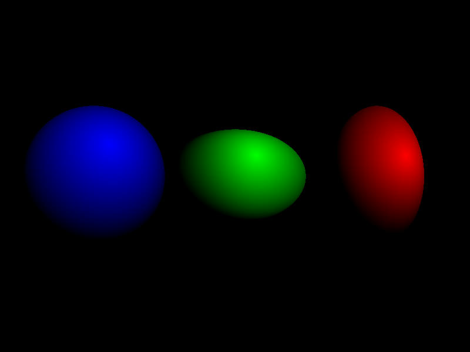

# Rust Ray Tracer

This code follows [this series of tutorials](https://www.youtube.com/playlist?list=PL3WoIG-PLjSt54LvzY2SuBQDl-cXa11Tm) from [QuantitativeBytes](https://www.youtube.com/@QuantitativeBytes).

The programm runs in the cpu, and it is single-threaded, for simplicity's sake.

<br>
<center>
    </img>
</center>
<br>

# Running

[SDL2.dll](https://pt.dll-files.com/sdl2.dll.html) and [SDL2_tff.dll](https://www.dllme.com/dll/files/sdl2_ttf_dll.html) are needed.

Download it and place in the "./target/release" folder if you don't have [SDL2](https://wiki.libsdl.org/SDL2/Installation) installed.

``` 
cargo run --release
```